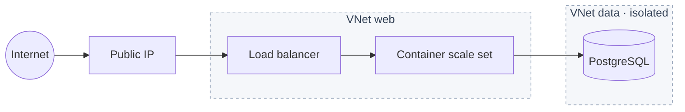
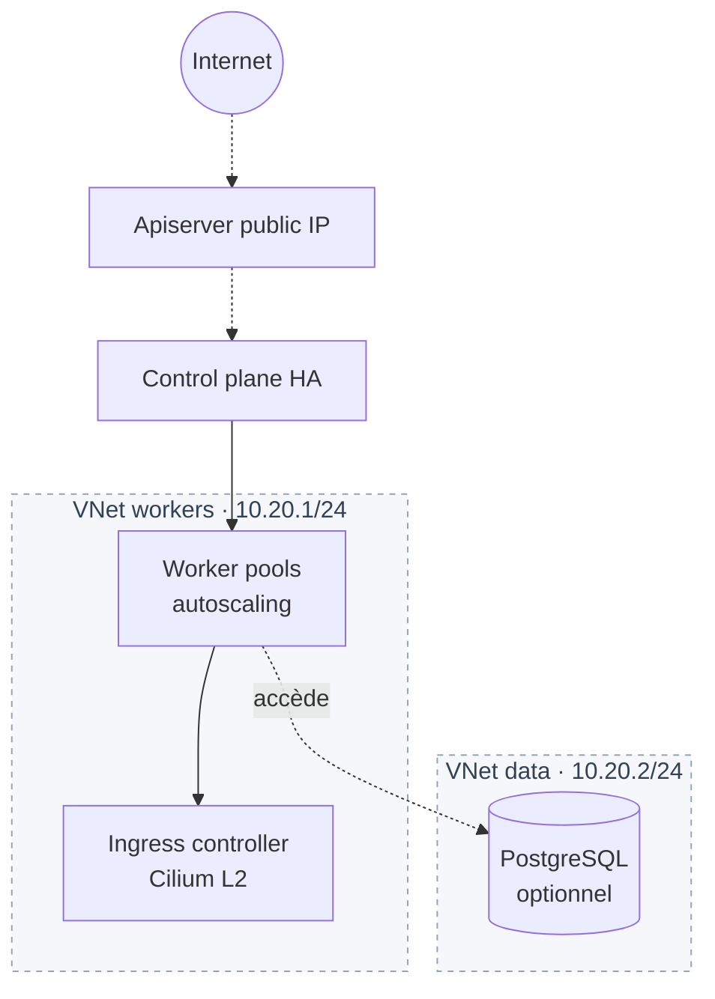
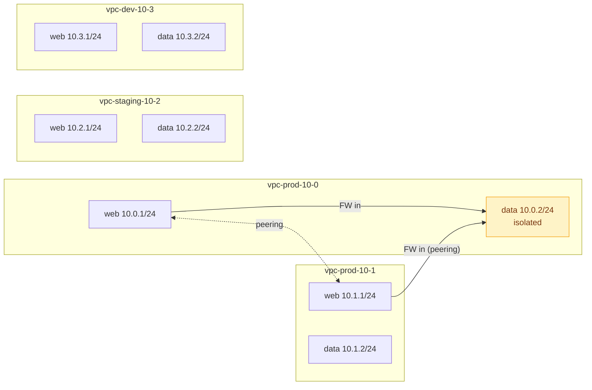

# Landing zones

Stacks Terraform clé en main qui composent les modules en architectures complètes et opinionées. Chaque dossier est utilisable tel quel ou comme point de départ à forker.

| Zone | Pour quoi |
|------|-----------|
| [`basic-web-app`](basic-web-app/) | App web 3-tier (LB → containers → DB) sur 1 VPC. |
| [`k8s-platform`](k8s-platform/) | Cluster K8s managé + node pools + ingress + DB optionnelle. |
| [`vpc-design`](vpc-design/) | Layout multi-VPC (prod/staging/dev) avec peering inter-VPC et VNet isolé. |

---

## `basic-web-app` — application web publique

1 VPC, 2 VNets (`web` 10.0.1/24, `data` 10.0.2/24), 1 LB, N containers, 1 PG managé optionnel. Voir [`basic-web-app/`](basic-web-app/).

---

## `k8s-platform` — Kubernetes managé prêt à l'emploi

Cluster avec pool initial + N pools additionnels, ingress incluster, DB optionnelle. Voir [`k8s-platform/`](k8s-platform/).

---

## `vpc-design` — fleet multi-VPC

Découpage réseau pour une organisation multi-environnement : CIDRs non chevauchants, un VNet `data` isolé en prod avec règles firewall, peering L3 entre deux `web` de prod. Pas de compute — c'est le socle réseau. Voir [`vpc-design/`](vpc-design/).
