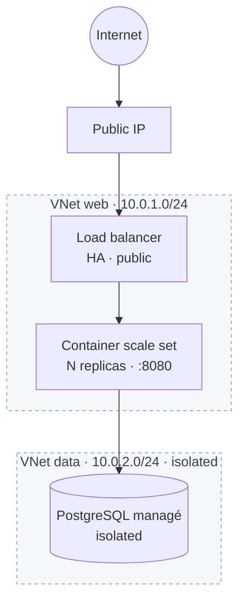

# Landing zone `basic-web-app`

Compose une stack 3-tier complète prête à servir une application web :



Composants créés :
- 1 clé SSH (`atomic/ssh-key`)
- 1 VPC + 2 VNets `web` (10.0.1.0/24) et `data` (10.0.2.0/24) avec firewall (`network/vpc`)
- N containers d'app (plan configurable, attachés au LB ou à l'AppGW)
- 1 IP publique
- **Exposition au choix** via `exposure_type` :
  - `"lb"` (défaut, rétrocompat) — Load Balancer L4 (HTTP + optionnellement HTTPS pass-through).
  - `"appgw"` — Application Gateway L7 (HTTPS auto via Let's Encrypt, routing, HSTS, rate limit, WAF).
- 1 PostgreSQL managé (optionnel via `enable_database`)

## Exemple

```hcl
module "web_app" {
  source = "github.com/cetic-group/cetic-cloud-terraform-modules//landing-zones/basic-web-app?ref=v0.1.0"

  org_prefix     = "acme"
  region         = "RNN"
  ssh_public_key = file("~/.ssh/id_ed25519.pub")

  app_replicas    = 3
  app_listen_port = 8080
  expose_https    = false

  enable_database = true
  db_plan         = "small"
  db_tier         = "prod"
}

output "url" {
  value = module.web_app.public_url
}

output "db_uri" {
  value     = module.web_app.database_uri
  sensitive = true
}
```

## Exemple — mode AppGW (HTTPS auto + WAF + HSTS)

```hcl
module "web_app" {
  source = "github.com/cetic-group/cetic-cloud-terraform-modules//landing-zones/basic-web-app?ref=v0.8.0"

  org_prefix     = "acme"
  region         = "RNN"
  ssh_public_key = file("~/.ssh/id_ed25519.pub")
  app_root_password = var.app_root_password

  exposure_type  = "appgw"
  appgw_plan     = "medium"
  appgw_hostname = "app.example.com"
  appgw_acme_challenge = "http01" # cert Let's Encrypt — CNAME requis avant apply
  appgw_hsts_enabled   = true
  appgw_rate_limit_per_sec = 500
}

output "url" {
  value = module.web_app.public_url   # https://app.example.com
}
```

## Inputs

| Name | Type | Default | Description |
|------|------|---------|-------------|
| `org_prefix` | string | required | Préfixe métier (`[a-z0-9-]+`, 3-32 chars). Préfixe toutes les ressources. |
| `region` | string | required | `RNN`, `PAR` ou `ABJ`. |
| `ssh_public_key` | string | required | Clé publique OpenSSH (`file("~/.ssh/id_ed25519.pub")`). |
| `app_root_password` | string (sensitive) | required | Mot de passe root des containers. |
| `app_plan` | string | `"small"` | Plan d'instance des containers. |
| `app_template` | string | `"ubuntu-24.04"` | Template OS. |
| `app_replicas` | number | `2` | Nombre de containers (1-20). |
| `app_listen_port` | number | `8080` | Port d'écoute de l'app sur le container. |
| `exposure_type` | string | `"lb"` | `"lb"` (L4) ou `"appgw"` (L7). |
| `lb_plan` | string | `"small"` | Mode `lb` : capacité du LB (`small` / `medium` / `large`). Immuable. |
| `expose_https` | bool | `false` | Mode `lb` uniquement : listener TCP/443 supplémentaire. |
| `appgw_hostname` | string | `null` | Mode `appgw` : FQDN exposé (auto si null). |
| `appgw_plan` | string | `"small"` | Mode `appgw` : `small` / `medium` / `large`. |
| `appgw_acme_challenge` | string | `"http01"` | Mode `appgw` : `http01` / `dns01` / `null` (pas de cert). |
| `appgw_acme_dns_provider` | string | `null` | Mode `appgw` + `dns01` : clé provider DNS. |
| `appgw_acme_dns_credentials` | map(string) | `null` | Mode `appgw` + `dns01` : credentials DNS (sensible). |
| `appgw_hsts_enabled` | bool | `true` | Mode `appgw` : active HSTS. |
| `appgw_rate_limit_per_sec` | number | `null` | Mode `appgw` : rate limit global par IP. |
| `enable_database` | bool | `true` | Provisionne PostgreSQL managé. |
| `db_plan` | string | `"small"` | Plan PG. |
| `db_replicas` | number | `1` | `1` (dev) ou `3` (prod HA). |
| `db_engine_version` | string | `"16"` | Version PG majeure. |
| `db_storage_gb` | number | `20` | Taille stockage PG (1-1000). |
| `tags_extra` | list(string) | `[]` | Tags additionnels propagés partout. |

## Outputs

| Name | Sensitive | Description |
|------|-----------|-------------|
| `public_url` | no | URL publique de l'app. HTTPS si `exposure_type=appgw`, HTTP via IP sinon. |
| `public_ip` | no | IP publique attachée (LB ou AppGW). |
| `exposure_type` | no | Mode retenu (`lb` ou `appgw`). |
| `lb_id` | no | UUID du LB. `null` si `exposure_type=appgw`. |
| `lb_vip_address` | no | VIP privée LB. `null` si `exposure_type=appgw`. |
| `appgw_id` | no | UUID de l'AppGW. `null` si `exposure_type=lb`. |
| `appgw_hostname` | no | Hostname AppGW. `null` si `exposure_type=lb`. |
| `appgw_vip_address` | no | VIP privée AppGW. `null` si `exposure_type=lb`. |
| `vpc_id` | no | UUID du VPC. |
| `container_ids` | no | Map nom → UUID des containers d'app. |
| `ssh_key_id` | no | UUID de la clé SSH. |
| `database_endpoint` | no | `host:port` PostgreSQL. |
| `database_admin_username` | no | Username admin PG. |
| `database_id` | no | UUID instance PG (pour `cetic db pg credentials`). |
| `database_tier` | no | `dev` / `prod`. |

## Notes

- **CIDRs hardcodés** (`10.0.1.0/24` web, `10.0.2.0/24` data). Pour les modifier, copier la landing zone localement et l'ajuster — ces CIDRs sont volontairement opinionnated pour garder le composant démarrable en quelques lignes. Pour des topologies custom, utiliser directement le module `network/vpc`.
- **`db_replicas` immutable** : pour upgrader `dev → prod`, snapshot + nouvelle instance + restore. Pas de migration in-place.
- **Migration `lb` → `appgw`** : changer `exposure_type` reconstruit l'exposition (destroy LB + create AppGW) — l'IP publique est conservée (même ressource `ccp_public_ip`). Prévoir une fenêtre de migration brève.
- **Mode `appgw` + `appgw_acme_challenge = "http01"`** : le hostname doit résoudre vers l'IP publique de la gateway (CNAME/A) **avant** l'apply (sinon le challenge ACME échoue). Utiliser `dns01` (+ `appgw_acme_dns_provider`/`appgw_acme_dns_credentials`) pour éviter le pré-requis DNS A/CNAME.
