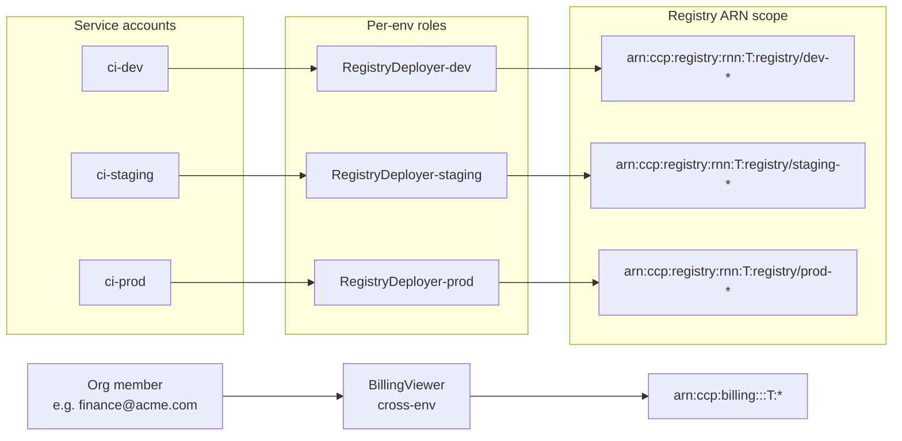

# Landing zone `iam-team-segregation`

Compose une stack IAM **prête à segréger les permissions par environnement** pour un workflow CI/CD multi-stage (dev → staging → prod).



## Ce que la landing zone crée

Pour chaque environnement listé dans `envs` (défaut `["dev", "staging", "prod"]`) :

- Un **service account** `ci-<env>` (token `ccp_sa_*` retourné une seule fois en sortie).
- Un **rôle custom** `RegistryDeployer-<env>` avec :
  - `Allow registry:Push, registry:Pull, registry:Get*, registry:List*` sur les registries dont le slug commence par `<env>-` (ARN pattern `arn:ccp:registry:<region>:<tenant_id>:registry/<env>-*`).
  - `Deny registry:Delete*, registry:RunGarbageCollection` sur tout (`*`) — pas de destruction depuis le CI.
- Une **assignment** liant le service account au rôle de son env.

Hors-segmentation :

- Un **rôle custom transverse** `BillingViewer` (lecture seule sur la facturation du tenant).
- Optionnellement, une **assignment** liant un org member humain (`billing_viewer_member_id`) à ce rôle.

## Exemple

```hcl
module "iam" {
  source = "github.com/cetic-group/cetic-cloud-terraform-modules//landing-zones/iam-team-segregation?ref=v0.5.0"

  tenant_id = "11111111-2222-3333-4444-555555555555"
  region    = "rnn"

  envs          = ["dev", "staging", "prod"]
  sa_expires_at = "2027-05-12T00:00:00Z"

  # Optionnel — pour attacher directement BillingViewer à un membre déjà existant
  billing_viewer_member_id = ccp_org_member.finance.id
}

# Tokens à pousser dans les secrets CI
output "ci_tokens" {
  value     = module.iam.service_account_tokens
  sensitive = true
}
```

## Inputs

| Name | Type | Default | Description |
|------|------|---------|-------------|
| `tenant_id` | string | required | UUID du tenant courant (utilisé dans les ARN patterns). |
| `region` | string | `"rnn"` | `rnn` / `par` / `abj` / `*`. Segment région des ARN registry. |
| `envs` | list(string) | `["dev", "staging", "prod"]` | Liste des environnements. 1-10 entrées, chacune `^[a-z][a-z0-9-]{0,15}$`. |
| `sa_expires_at` | string | `null` | RFC 3339 expiry appliqué à tous les SAs (recommandé en CI). |
| `billing_viewer_member_id` | string | `null` | UUID d'un org member à attacher automatiquement au rôle BillingViewer. |

## Outputs

| Name | Sensitive | Description |
|------|-----------|-------------|
| `service_account_ids` | no | Map env → UUID du SA. |
| `service_account_tokens` | **yes** | Map env → token complet (`ccp_sa_*`), affiché une seule fois. |
| `service_account_token_prefixes` | no | Map env → préfixe visible (`ccp_sa_xxxxxxxx`). |
| `registry_deployer_role_ids` | no | Map env → UUID du rôle `RegistryDeployer-<env>`. |
| `billing_viewer_role_id` | no | UUID du rôle `BillingViewer`. |
| `billing_viewer_assignment_id` | no | UUID de l'assignment BillingViewer, ou `null`. |

## Modèle de naming

| Type | Pattern | Exemple |
|------|---------|---------|
| Service account | `ci-<env>` | `ci-prod` |
| Role | `RegistryDeployer-<env>` | `RegistryDeployer-prod` |
| Registry ARN scope | `arn:ccp:registry:<region>:<tenant_id>:registry/<env>-*` | `arn:ccp:registry:rnn:T:registry/prod-*` |

## Notes

- **Aucune escalade possible** : les rôles `RegistryDeployer-<env>` ne contiennent que des actions `registry:*` — pas de `iam:*`. Conforme à la règle anti-self-elevation des Roles v1.
- **Conventions de nommage de la registry** : pour que la segregation fonctionne, les registries doivent suivre le pattern `<env>-<nom>` (ex: `prod-app-frontend`, `staging-app-backend`). Une registry nommée `myapp` ne sera couverte par aucun des trois rôles.
- **Rotation token** : `terraform taint module.iam.module.ci_sa[\"prod\"].ccp_service_account.this` puis `terraform apply` — le nouveau token apparaît dans `service_account_tokens["prod"]`.
- **Cross-tenant isolation** : la validation server-side rejette tout ARN dont le `tenant_id` segment ne matche pas le caller. La landing-zone reprend `var.tenant_id` à l'identique — assure-toi qu'il matche celui de l'API key utilisée par le provider.
- **DenyDestructive** est volontairement large (`registry:Delete*`, `registry:RunGarbageCollection`) — un opérateur humain qui a besoin de delete passe par la console avec un rôle `admin` plus large, pas par le CI.
