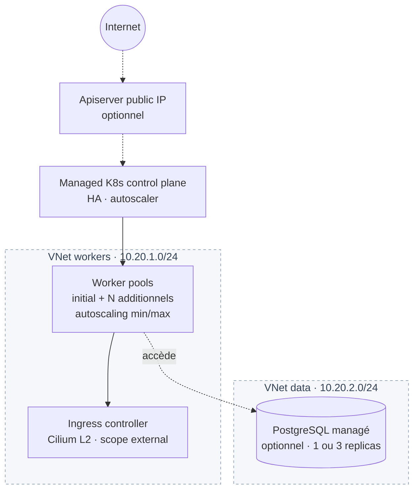

# Landing zone `k8s-platform`

Provisionne une plateforme Kubernetes complète prête à l'emploi :



Composants :
- VPC + 2 VNets (`workers` 10.20.1.0/24, `data` 10.20.2.0/24)
- Cluster K8s managé via `managed/k8s-cluster`, avec :
  - 1 initial pool (configurable via `initial_pool_plan` / `initial_pool_replicas`)
  - N pools additionnels via `additional_pools` (avec autoscaling min/max)
  - Ingress controller activé (incluster, scope external par défaut)
  - Apiserver public IP optionnel (`expose_apiserver_publicly`)
- PostgreSQL managé optionnel (via `enable_database = true`)

## Exemple

```hcl
module "platform" {
  source = "github.com/cetic-group/cetic-cloud-terraform-modules//landing-zones/k8s-platform?ref=v0.2.0"

  org_prefix = "acme"
  region     = "RNN"

  k8s_version           = "v1.31.4"
  initial_pool_replicas = 2
  initial_pool_plan     = "small"

  additional_pools = {
    cpu = { plan = "medium", replicas = 3, min_size = 2, max_size = 8 }
    gpu = { plan = "xlarge", replicas = 0, min_size = 0, max_size = 4, labels = { workload = "gpu" } }
  }

  expose_apiserver_publicly = true
  ingress_scope             = "external"

  enable_database = true
  db_plan         = "small"
  db_replicas     = 3   # tier prod (HA)
  db_storage_gb   = 50
}

output "kubeconfig_endpoint" {
  value = module.platform.api_endpoint
}

output "ingress_url" {
  value = "https://${module.platform.ingress_public_ip_address}"
}
```

## Inputs

| Name | Type | Default | Description |
|------|------|---------|-------------|
| `org_prefix` | string | required | Préfixe métier. |
| `region` | string | required | `RNN`/`PAR`/`ABJ`. |
| `k8s_version` | string | `"v1.31.4"` | |
| `k8s_tier` | string | `"dev"` | `dev` (single) ou `prod` (HA actif/passif + VIP flottante). Immuable. |
| `initial_pool_plan` | string | `"small"` | Plan du pool initial. |
| `initial_pool_replicas` | number | `2` | |
| `additional_pools` | map(object) | `{}` | Cf. `managed/k8s-cluster`. |
| `expose_apiserver_publicly` | bool | `false` | |
| `ingress_scope` | string | `"external"` | `external`/`internal`. |
| `enable_database` | bool | `true` | |
| `db_plan` | string | `"small"` | |
| `db_replicas` | number | `1` | `1` (dev) / `3` (prod HA). |
| `db_storage_gb` | number | `20` | |
| `tags_extra` | list(string) | `[]` | |

## Outputs

| Name | Description |
|------|-------------|
| `cluster_id` / `cluster_name` | |
| `api_endpoint` | Récupérer kubeconfig via `cetic k8s kubeconfig <id>`. |
| `apiserver_public_ip_address` | |
| `ingress_public_ip_address` / `ingress_internal_ip` | |
| `vpc_id` | |
| `database_endpoint` / `database_id` | Si `enable_database=true`. Password via `data.ccp_db_pg_credentials`. |

## Notes

- **CIDRs hardcodés** (`10.20.1.0/24` workers, `10.20.2.0/24` data) — pour les modifier, copier la landing zone en local.
- Le **kubeconfig** n'est pas exposé en TF. Le récupérer hors-bande via CLI / API. Roadmap : datasource `ccp_k8s_kubeconfig` (v0.9+).
- **Mode `incluster`** par défaut pour l'ingress = HA inter-worker (Cilium L2 announce, failover ~22s).
