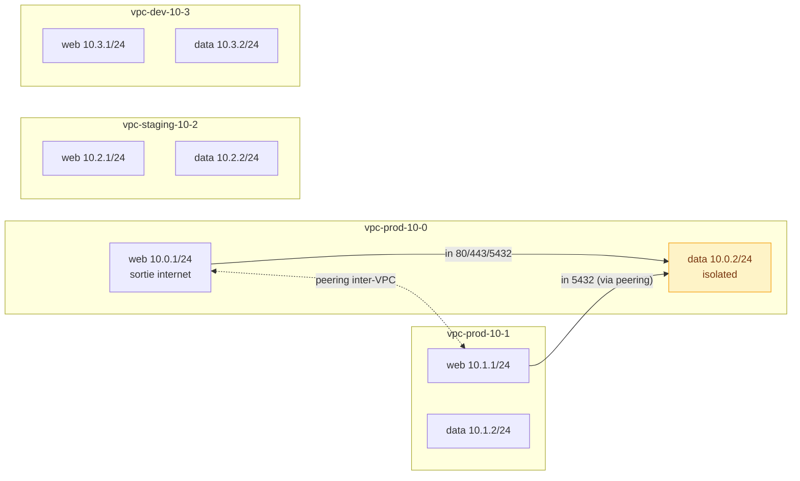

# Landing zone `vpc-design`

Découpage réseau multi-VPC pour une organisation multi-environnement. Pas de compute — uniquement le socle réseau (VPCs, VNets, peerings, isolation).



> Flèches pleines = règles firewall ACCEPT (in) sur le VNet `data` isolé. Flèche pointillée = peering L3 inter-VPC.

## Composants

- **4 VPCs** (`prod-10-0/1`, `staging-10-2`, `dev-10-3`) via `modules/network/vpc`, CIDRs `10.<env>.0.0/16` non chevauchants
- **8 VNets** (un `web` + un `data` par VPC)
- **1 peering inter-VPC** entre `prod-10-0/web` et `prod-10-1/web` via `modules/network/vnet-peering`
- **VNet `data` de prod-10-0 isolé** (`isolated = true`) avec règles firewall ACCEPT explicites : HTTP/HTTPS/PG depuis `web` local + PG depuis le peer prod-10-1/web

## Conventions choisies ici

- 1 octet par environnement dans le second octet du CIDR : `10.<env>.<vnet>.0/24`
- VNet `web` SNAT activé (sortie internet), VNet `data` SNAT off (privé)
- Isolation L3 + firewall ACCEPT seulement sur les VNets sensibles (data en prod)
- Peering déclaré côté prod-10-0 uniquement (les peerings sont symétriques, on déclare une fois)

## Usage

```bash
export CCP_API_KEY="ccp_live_..."
terraform init
terraform apply
```

La topologie est entièrement pilotée par `var.vpc_map` dans `vars.auto.tfvars` — modifier la map suffit pour ajouter un VPC ou un VNet.
