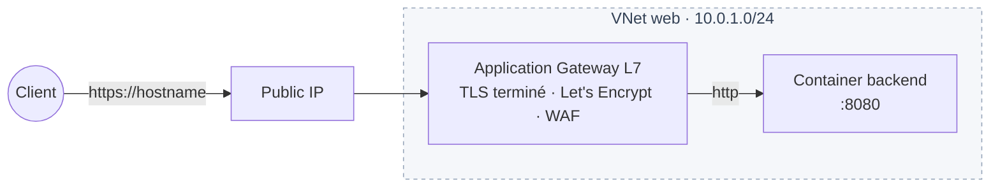

# Landing zone `web-app-with-tls`

Stack web minimale **HTTPS + WAF + basic auth** pour un domaine client unique :



Composants créés :

- 1 clé SSH (`atomic/ssh-key`)
- 1 VPC + 1 VNet `web` (10.0.1.0/24) (`network/vpc`)
- 1 IP publique (`network/public-ip`) attachée à l'AppGW
- 1 container backend
- 1 Application Gateway L7 avec :
  - 1 listener custom-domain ACME DNS-01 (cert Let's Encrypt auto)
  - 1 target group pointant vers le container
  - 1 route racine avec WAF (`permissive` par défaut) et **basic auth optionnel**

Cas d'usage typique : héberger une app interne (admin panel, dashboard) sur un domaine client avec HTTPS, isolation IP via basic auth, sans monter une stack complexe.

## Exemple

```hcl
module "web" {
  source = "github.com/cetic-group/cetic-cloud-terraform-modules//landing-zones/web-app-with-tls?ref=v0.8.0"

  org_prefix     = "acme"
  region         = "RNN"
  hostname       = "admin.acme.example.com"
  ssh_public_key = file("~/.ssh/id_ed25519.pub")

  app_root_password = var.app_root_password
  app_listen_port   = 8080
  app_health_path   = "/healthz"

  appgw_plan = "small"
  waf_preset = "strict"

  basic_auth_users = [
    { user = "alice", password = var.alice_password },
    { user = "bob",   password = var.bob_password },
  ]
}

output "url" {
  value = module.web.url
}
```

### `terraform apply` complet

```bash
# Pré-requis : CNAME admin.acme.example.com → <appgw>.app.cloud.cetic-group.com
# (le sous-domaine cible est dérivé du tenant, l'API le retourne au 1er apply
#  via le sous-domaine auto ; donc en pratique 2 applys :
#  - 1er apply : crée l'AppGW en mode "auto subdomain" pour récupérer la cible CNAME
#  - configurer le CNAME chez son registrar
#  - 2e apply : ajoute le custom domain → ACME émet le cert)

export TF_VAR_app_root_password='S3curePass!2026'
export TF_VAR_alice_password='alicepw'
export TF_VAR_bob_password='bobpw'

terraform init
terraform apply \
  -var 'org_prefix=acme' \
  -var 'region=RNN' \
  -var 'hostname=admin.acme.example.com' \
  -var 'ssh_public_key='"$(cat ~/.ssh/id_ed25519.pub)"
```

## Inputs

| Name | Type | Required | Default | Description |
|------|------|----------|---------|-------------|
| `org_prefix` | string | yes | — | Préfixe métier (3-32 chars). |
| `region` | string | yes | — | `RNN` / `PAR` / `ABJ`. |
| `ssh_public_key` | string | yes | — | Clé publique OpenSSH. |
| `hostname` | string | yes | — | FQDN client servi par l'AppGW (DNS-01 ACME). |
| `basic_auth_users` | list(object) (sensitive) | no | `null` | Credentials `{user, password}`. `null` = pas d'auth. |
| `app_plan` | string | no | `"small"` | Plan container backend. |
| `app_template` | string | no | `"ubuntu-24.04"` | Template OS. |
| `app_root_password` | string (sensitive) | yes | — | Pw root du container (8-128 chars). |
| `app_listen_port` | number | no | `8080` | Port d'écoute backend. |
| `app_health_path` | string | no | `"/"` | Path HTTP du health check. |
| `appgw_plan` | string | no | `"small"` | `small` / `medium` / `large`. |
| `waf_preset` | string | no | `"permissive"` | `off` / `permissive` / `strict`. |
| `tags_extra` | list(string) | no | `[]` | Tags additionnels. |

## Outputs

| Name | Sensitive | Description |
|------|-----------|-------------|
| `url` | no | URL HTTPS publique de l'app. |
| `public_ip` | no | IP publique attachée à l'AppGW. |
| `hostname` | no | Hostname servi. |
| `appgw_id` | no | UUID de l'Application Gateway. |
| `appgw_vip_address` | no | VIP privée de la gateway dans le VNet. |
| `appgw_acme_status` | no | `pending` / `issued` / `failed`. |
| `vpc_id` | no | UUID du VPC. |
| `container_id` | no | UUID du container backend. |
| `basic_auth_secret_ref` | no | Ref opaque Secret Manager (`null` si pas d'auth). |
| `ssh_key_id` | no | UUID de la clé SSH. |

## Notes

- **Single backend** : cette landing zone vise le cas simple (1 container). Pour du multi-instance, multi-route ou multi-hostname, utiliser directement `modules/managed/application-gateway` qui expose toute la richesse du composable.
- **DNS pré-apply** : le CNAME doit être en place avant le `terraform apply` (sinon ACME DNS-01 échoue et la gateway reste en `acme_status=pending`). Idéalement, un 1er apply avec un sous-domaine auto, configurer le CNAME, puis switcher `hostname` vers le custom domain.
- **`basic_auth_users` — sensibilité du state** : les mots de passe sont persistés en clair dans le state Terraform. Utiliser un backend chiffré (S3+KMS, Terraform Cloud, Vault). Cf. doc `modules/atomic/appgw-route` pour les détails.
- **WAF `permissive` par défaut** : passer à `strict` après validation que l'app ne triggere pas de faux positifs. `off` désactive complètement (déconseillé en prod).
- **Pas de base de données** : si besoin, ajouter `module.db = managed/database/pg` à côté et l'attacher au VPC. Voir `landing-zones/basic-web-app` pour un exemple 3-tier complet.
